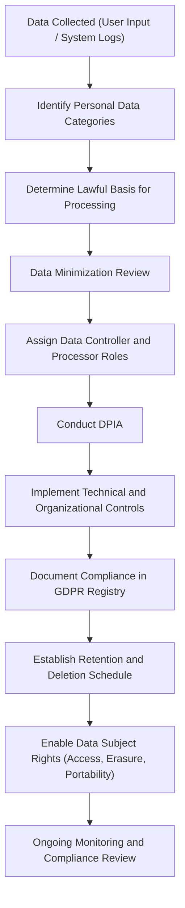

# Cyber Governance Labs – S. Smith

This repository contains hands-on labs focused on security governance and privacy, starting with GDPR. The goal is to show how I think through structured decision-making, risk, and compliance workflows, not just technical configuration.

These labs connect directly to the strengths highlighted in my CyberGen.ai results: pattern recognition, structured analysis, anomaly detection, and systematic problem solving.

---

## Repository Structure

- `01-GDPR-Lab-DPIA/`  
  First lab focused on a GDPR Data Protection Impact Assessment (DPIA) for a fictional organization.

- `02-ROPA-Governance-Scenario/`  
  Follow-on lab (work in progress) for Records of Processing Activities (ROPA), breach notification timelines, and cross-border data transfer risk.

- `templates/`  
  Shared governance templates, such as DPIA and ROPA skeletons or simple checklists.

---

## Lab 01 – GDPR DPIA Overview

The first lab walks through a simplified DPIA for a fictional web application that processes personal data. The focus is on:

- Identifying data categories and processing purposes
- Selecting an appropriate lawful basis
- Evaluating risks to confidentiality, integrity, and availability
- Proposing controls and documenting decisions in a repeatable way

### GDPR Governance Flow (High-Level)

---

## Quick Reflection (Work in Progress)

Starting these governance labs helped me understand how structured documentation reinforces every part of privacy and security decision-making. Building the DPIA flow and the ROPA entry showed me how data mapping, lawful basis selection, and risk identification connect to each other. 

I can already see how this type of work aligns with the cognitive strengths highlighted in my CyberGen.ai results — especially my preference for structure, pattern recognition, and depth-focused problem solving. As I keep building these labs, I want to refine how I think about risk and controls, and explore how this governance mindset overlaps with AppSec and OT/ICS security.

More reflections will be added as the labs progress.

