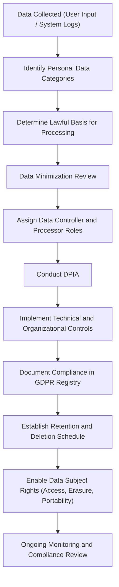

# Cyber Governance Labs – S. Smith

This repository contains hands-on labs focused on security governance, privacy, and structured decision-making. These labs demonstrate how I analyze risk, document compliance workflows, and apply governance principles across different scenarios.

These labs reflect strengths highlighted in my CyberGen.ai assessment: pattern recognition, structured analysis, anomaly detection, and systematic problem solving.

---

## Repository Structure

### **01-GDPR-Lab-DPIA/**

A foundational lab walking through a GDPR Data Protection Impact Assessment (DPIA) for a fictional organization. Includes:

* Data inventory and mapping
* Lawful basis selection
* Risk evaluation for confidentiality, integrity, availability
* Control selection and justification

### **02-ROPA-Governance-Scenario/**

A follow-on scenario (work in progress) covering:

* Records of Processing Activities (ROPA)
* Breach notification timelines
* Cross-border data transfer risks
* Accountability documentation practices

### **templates/**

Shared governance templates such as:

* DPIA skeleton
* ROPA skeleton
* Checklists
* Notes pages

---

## Lab 01 – GDPR DPIA Overview

This lab introduces the fundamentals of a GDPR Data Protection Impact Assessment using a fictional web application that processes personal data.

The DPIA workflow focuses on:

* Identifying personal data categories and processing purposes
* Selecting a lawful basis for each processing activity
* Evaluating risks related to confidentiality, integrity, and availability
* Proposing controls and documenting the rationale

---

## GDPR Governance Flow (High-Level)



---

## ROPA Scenario (Preview)

*This section will expand as Lab 02 is completed.*

The ROPA governance scenario focuses on understanding:

* How processing activities are categorized
* Which parties are involved (controllers, processors, sub-processors)
* What data elements are collected and shared
* How to document transfer risks and lawful mechanisms
* Retention rules and accountability requirements

Future additions will include:

* A ROPA flowchart using Mermaid
* Realistic organization-wide processing categories
* Example cross-border data transfer analysis

---

## Quick Reflection

Creating these governance labs has reinforced how structured documentation underpins every part of privacy and security. Mapping data flows, assigning lawful bases, and evaluating risks all support better decision-making and clearer accountability.

This approach aligns deeply with how I naturally work: pattern-recognizing, structure-driven, and detail-oriented. As I continue expanding these labs, I plan to explore how this mindset overlaps with AppSec, OT/ICS, threat modeling, and risk frameworks.

More reflections will be added as development continues.

---

## Future Improvements

Planned enhancements to this repository include:

* Additional governance labs (NIST, ISO 27001, HIPAA)
* A complete ROPA example with diagrams
* A governance "playbook" section for quick reference
* Example breach notification timelines
* Controls mapping (GDPR → NIST → ISO)

---

If you want help generating diagrams, templates, or expanding the governance scenarios, let me know—happy to keep building this with you.

## Governance Playbook

### Purpose of This Playbook

The Governance Playbook provides a consistent framework for approaching security governance tasks such as DPIAs, ROPAs, risk evaluations, data mapping, and compliance workflows. Its goal is to standardize how risk and privacy decisions are made, documented, and justified across technical and non-technical teams.

### Core Governance Principles

* Accountability
* Data Minimization
* Privacy by Design / Default
* Purpose Limitation
* Risk-Based Approach

### Governance Workflows

#### DPIA Workflow

1. Identify processing activities
2. Categorize personal data
3. Determine lawful basis
4. Map data flows and subprocessors
5. Evaluate risks
6. Identify and justify controls
7. Document the final assessment
8. Approve and monitor

#### ROPA Workflow

1. Identify processing operations
2. Document processing purposes
3. List personal data categories
4. Identify data subjects
5. Map recipients and transfers
6. Document retention
7. Document controls
8. Review regularly

#### Incident Response Governance

1. Validate incident
2. Classify severity
3. Trigger response roles
4. Contain and recover
5. Assess reporting requirements
6. Document actions
7. Post-incident review

### Governance Artifacts

* DPIA reports
* ROPA registry
* Data flow diagrams
* Asset inventories
* Control libraries
* Vendor risk assessments
* Retention schedules
* Consent records
* Incident logs

### Controls Reference

#### Technical Controls

* Encryption
* Access control
* DLP
* Monitoring
* Secure development practices
* Network segmentation

#### Organizational Controls

* Policies and procedures
* Training
* Vendor management
* Governance boards
* Change management
* Audits

### Decision-Making Framework

1. Identify
2. Analyze
3. Evaluate
4. Select
5. Document
6. Review

### Roles & Responsibilities

* Controller
* Processor
* DPO/Privacy Officer
* Security Governance Lead
* Engineering/AppSec

### Templates

#### DPIA Summary

```
Processing Activity:
Purpose:
Lawful Basis:
Data Categories:
Data Subjects:
Risks:
Mitigations:
Residual Risk:
Approval:
```

#### ROPA Entry

```
Activity:
Controller:
Processor:
Data Categories:
Data Subjects:
Purpose:
Transfers:
Retention:
Controls:
Notes:
```

### Future Enhancements

* NIST/ISO crosswalks
* OT/ICS governance examples
* Threat modeling integration
* Governance checklists
* AI governance considerations

### Versioning & Updates

This playbook will continue to expand as additional labs are completed.
